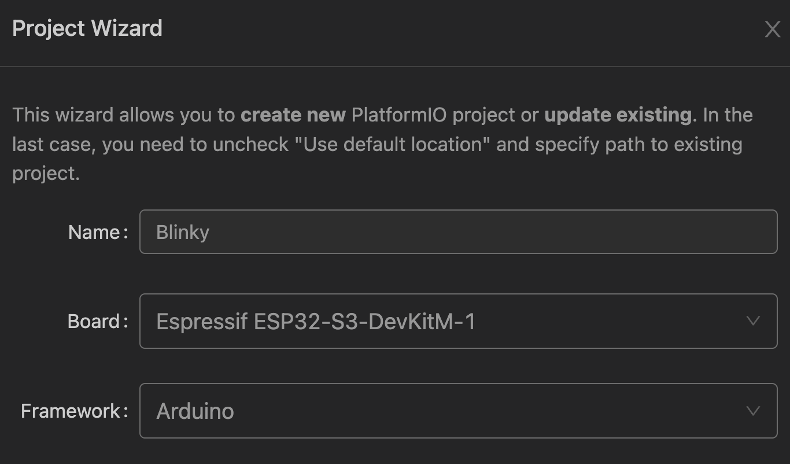

# Day 1: Setup Environment and Blink LEDs

Board: GOOUUU ESP32-S3-CAM

Manual: [https://pan.baidu.com/s/1ld5FolEM42IbgrTybdVaPA?pwd=8T8H](https://pan.baidu.com/s/1ld5FolEM42IbgrTybdVaPA?pwd=8T8H)? Password：8T8H

# Setting up environment

1. Install driver for the board
    
    “ESP32-S3 WROOM uses CH343 to download codes. So before using it, we need to install CH343 driver in our computers.”
    
    Link: https://www.wch-ic.com/search?t=all&q=ch343
    
    Why do we need CH343 driver even when we can already program it with Arduino?
    
    > The CH343 driver is for the CH343 USB-to-UART chip used for serial communication between your computer and the ESP32-S3 module. Here’s what you need to know:
    > 
    > 
    > 1.	**Function**: The driver enables the PC to communicate with the ESP32-S3 over USB, allowing you to upload code and send/receive data via the serial port.
    > 
    > 2.	**Necessity**: If you’re able to upload code (like the “blink” example) without installing the driver, it might be because:
    > 
    > •	The Arduino IDE has built-in support for the chip.
    > 
    > •	A generic USB driver is already handling the communication.
    > 
    > 3.	**Recommendation**: It’s a good idea to install the CH343 driver to ensure full functionality and compatibility, especially for advanced features or debugging.
    > 

1. Setup PlatformIO in VS Code
    
    
    

Why do we need to choose the right board?

> Choosing the correct board in PlatformIO is crucial for ensuring proper functionality and compatibility in embedded projects. The right board selection guarantees that:
> 
> 
> 1.	**Pin Configuration**: The correct pin mappings are used, allowing for seamless integration of hardware components (sensors, actuators, displays, etc.).
> 
> 2.	**Library Compatibility**: Libraries tailored for specific boards can be utilized effectively, avoiding compilation errors and runtime issues.
> 
> 3.	**Full Functionality**: Access to all features and peripherals of the board is enabled, particularly for specialized functionalities like camera support, which may require specific configurations.
> 
> 4.	**Simplified Debugging**: Choosing the right board reduces the complexity of troubleshooting issues related to hardware connections and functionality.
> 

How to choose the right board?

> 1.	**Review Documentation**: Consult the manufacturer’s manual for the board to understand its features, pinout, and configurations.
> 
> 
> 2.	**Utilize PlatformIO Board Definitions**: Check the available board definitions in PlatformIO. Opt for a board definition that closely matches your hardware, such as ESP32-S3-CAM for camera modules.
> 
> 3.	**Consult the Datasheet**: Refer to the ESP32-S3 datasheet for a comprehensive overview of the chip’s capabilities and pin functionalities.
> 
> 4.	**Community Resources**: Leverage forums, GitHub repositories, and community contributions to find additional insights and pin mappings from other users.
> 
> 5.	**Test Basic Functionality**: Implement simple test scripts to verify that the selected board configuration works as expected with your hardware components.
> 

After comparing the pin-out, most of them are the same as the ESP32-S3-DevKitM-1, that’s why I choose it. In the manual “ESP32-S3-Dev Module” is used, but this is not available in PlatformIO. However, the LED pinout is different, we will try the blinky example to see if it works (it shouldn’t)


# Run Example “Blinky”

```cpp
#include <Arduino.h>

/*
  Simple Blink sketch
  simple-blink.cpp
  Use for PlatformIO demo

  From original Arduino Blink Sketch
  https://www.arduino.cc/en/Tutorial/Blink
  
  DroneBot Workshop 2021
  https://dronebotworkshop.com
*/

void setup()
{
  // Initialize LED pin as an output.
  pinMode(LED_BUILTIN, OUTPUT);
  Serial.begin(9600);
}

void loop()
{
  // Set the LED HIGH
  digitalWrite(LED_BUILTIN, HIGH);
  Serial.println("HIGH");

  // Wait for a second
  delay(1000);

  // Set the LED LOW
  digitalWrite(LED_BUILTIN, LOW);
  Serial.println("LOW");

   // Wait for a second
  delay(1000);
}
```

Click “compile” on PlatformIO, which is the ✅ button at the bottom left corner, success.

Click “Upload”, which is the ➡️ button, success

Click “Serial Monitor”, which is the 🔌 button, we can see that the LED is blinking and the serial monitor is printing out the correct message.


<aside>
❓

The ESP32-S3-CAM has LED_ON at GPIO 2 and LED_TX at GPIO 43, while the ESP32-S3-DevKitM-1 has an RGB_LED at GPIO 48.

I ran the blinky code, expecting it not to work, but surprisingly, the LED was blinking. Here’s the code:

```cpp
digitalWrite(LED_BUILTIN, HIGH);
```

where

```cpp
static const uint8_t LED_BUILTIN = SOC_GPIO_PIN_COUNT + PIN_NEOPIXEL;
#define SOC_GPIO_PIN_COUNT (49)
#define PIN_NEOPIXEL (48)
```

Why does the code work?

</aside>

I tried to write 

```cpp
#define LED_BUILTIN 97
```

in my main.cpp and it works. but if I define it to be 2 it won’t work. This is interesting. 

If I define LED_BUITIN to be 43 it will blinks another LED, but this will stop the serial communication since GPIO43 is also Serial TX.

The only remaining question is why is it 97 instead of 2 as shown in the pinout. 


I tried to use another board’s ADC to check if GPIO2 is high when the LED turns on.

- Wiring:
    
    ESP32-S3-CAM        SEEED XIAO nRF52840
    
               GPIO2  -------->  A0(ADC)
               GND    -------->  GND
    
- Code:
    
    ```cpp
    void setup() {
      // put your setup code here, to run once:
      Serial.begin(9600);
      pinMode(A0, INPUT);
    }
    
    void loop() {
      // put your main code here, to run repeatedly:
      int val_adc = analogRead(A0);
      Serial.print(val_adc);
      Serial.print("\n");
      delay(100);
    }
    ```
    
- Output:
    
    Only when #define LED_BUILTIN 2 we can see GPIO2 is oscillating, otherwise it’s just noise(forgot to screenshot).
    
    
    
- Conclusion:
    
    I still don’t know why we should #define LED_BUILTIN 97 to blink the LED, I will ask in the forum to figure it out.
    

<aside>
❓

How to change baud rate?

Go to file → platformio.ini, add 

```cpp
monitor_speed = 115200
```

</aside>

# Connecting GitHub with VSCode

Tutorial: [https://code.visualstudio.com/docs/sourcecontrol/intro-to-git](https://code.visualstudio.com/docs/sourcecontrol/intro-to-git)

1. Create a new repository on my GitHub
2. Clone to my local computer
3. Log in my VSCode with my GitHub account
4. Open Source Control in VSCode and open repository
5. Sign in to my GitHub
6. Commit and Push
